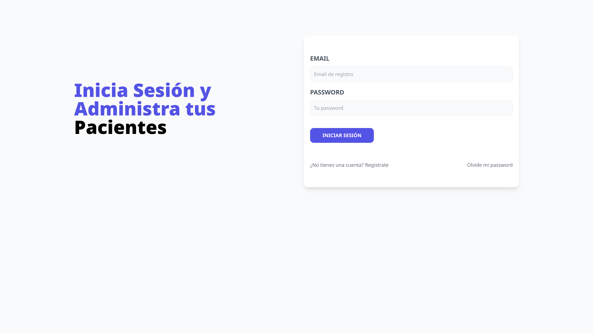

# Administrador de Pacientes de Veterinario (APV)

Aplicación MERN para registrar datos de pacientes (las mascotas y sus dueños) y médicos veterinarios. Al registrar un paciente, este se le asigna al medico que este logeado en el sistema en ese momento.


## Demo

[Ver Demostración](https://system-veterinarios-mern.netlify.app/)



## Features

- Registrar usuario del médico mediante email
- Confirmación de cuenta vía email
- Registrar nombre de la mascota, nombre del propietario, email del propietario, fecha de alta y síntomas
- Editar los datos del paciente y su dueño
- Eliminar registro de un paciente en específico
- Modificar datos del perfil de la cuenta


## Tech Stack

**Backend:** 
* 
* 
* 
* 

**Frontend**
* 
* 
* 
* 

**Deploy**
* [](https://app.netlify.com/projects/system-veterinarios-mern/deploys)


## Installation

#### 1) Clonar el repositorio
```bash
    git clone https://github.com/lic-emir/apv-fullstack.git
    cd apv-fullstack
```
#### 2) Instalar las dependencias del backend
```bash
    cd backend
    npm install
```
#### 3) Crear el archivo .env para el backend
Para GNU-Linux / macOS
```bash
    touch .env
```
Para Windows
```bash
    New-Item -Path . -Name ".env" -ItemType "File"
```
El archivo .env debe tener las siguientes variables, y sus valores deben ser definidos por ti
- MONGO_URI
- JWT_SECRET
- EMAIL_USER
- EMAIL_PASS
- EMAIL_HOST
- EMAIL_PORT
- FRONTEND_URL
#### 4) Instalar las dependencias de frontend
```bash
    cd frontend
    npm install
```
#### 5) Crear el archivo .env para el frontend
Para GNU-Linux / macOS
```bash
    touch .env
```
Para Windows
```bash
    New-Item -Path . -Name ".env" -ItemType "File"
```
El archivo .env debe tener la siguiente variable y su valor debe ser definido por ti:
- VITE_BACKEND_URL

#### 6) Iniciar la aplicación
```bash
    # En una terminal para el backend
    cd backend
    npm run dev
    
    # En otra terminal para el frontend
    cd frontend
    npm run dev
```
## License

[MIT](https://choosealicense.com/licenses/mit/)


## Acknowledgements

 - [Tailwind CSS](https://tailwindcss.com/)
 - [Profesor](https://github.com/codigoconjuan)
 